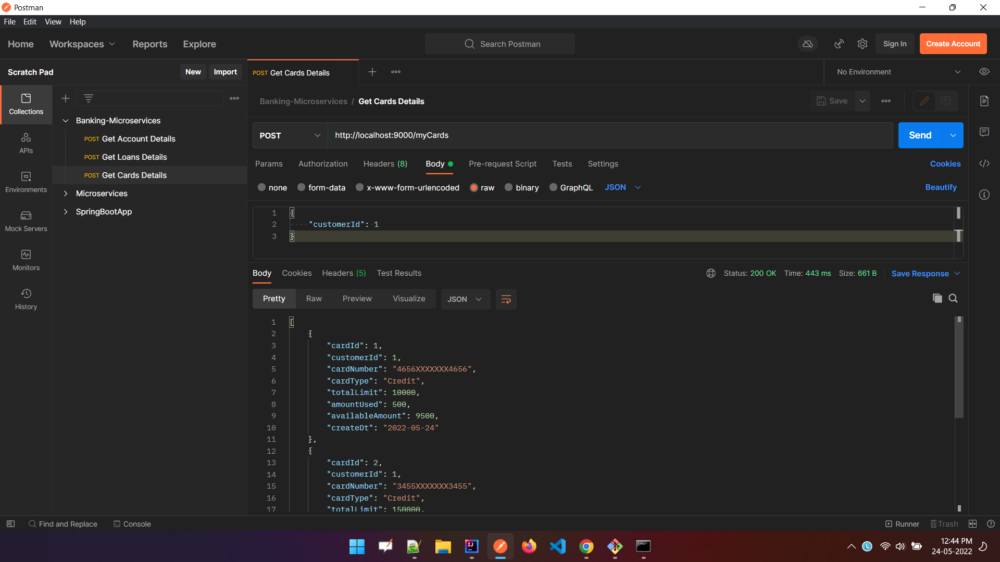
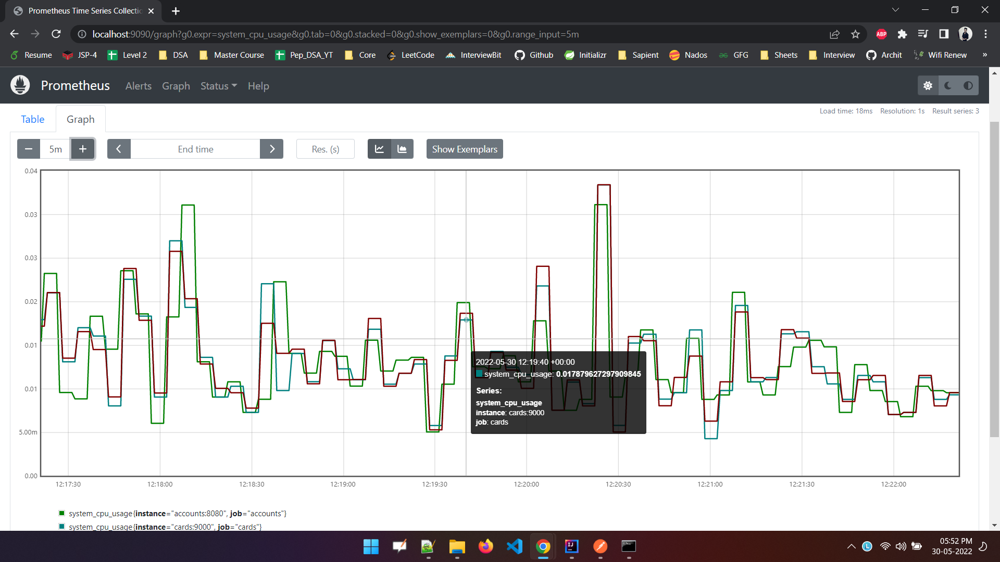

# YeezyBank-Microservices
<h2>Output Screens :-<h2> 
<h3>Accounts Service</h3>

  

<h3>Loans Service</h3>

  

<h3>Cards Service</h3>

  

<h3>Dev-Profile</h3>

  

<h3>Prod-Profile</h3>

  

<h3>Communication Between Services</h3>

  

<h3>Refreshing Properties</h3>

  

<h3>Shutting Down</h3>

  

 <h3>DockerHub Images</h3>

  

<h3>Docker Images</h3>

  

<h3>Docker Processes</h3>

  

 
<h3>Eureka Server</h3>

  

<h3>Gateway Server</h3>

  

<h3>Circuit-Breaker Events</h3>

  

<h3>Custom Routing</h3>

  

<h3>Zipkin Server</h3>

  

<h3>RabbitMQ Server</h3>

  

<h3>RabbitMQ Messages</h3>

  

<h3>RabbitMQ Messages Information</h3>

  

<h3>Prometheus Dashboard</h3>

  

<h3>Prometheus Graphs</h3>

  

<h3>Grafana Dashboard</h3>

  

